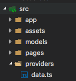

You probably have noticed that when we refresh our app that we lose our locations and todos. We’ll need to persist this data on our mobile app to be of any good use. Some of the local storage options Ionic offers are: 

Local Storage

--------------

Ionic has the ability to utilize many storage options. [Local Storage](http://www.w3schools.com/html/html5_webstorage.asp) is the most basic way to store data locally in the browser, since your app is a hybrid app, you can take advatage of this HTML5 feature. [Local Storage](http://www.w3schools.com/html/html5_webstorage.asp) is best for temporary data such as session tokens.

### SQLite

Mobile devices have an embedded SQL database.

Storage
-------

Ionic has a great [storage service](https://ionicframework.com/docs/v2/storage/) that will automagically use the best availabe storage method. We’ll take advantage of this with SQLite since `Storage` prioritizes it. Install SQLite by running the following command:

`cordova plugin add cordova-sqlite-storage —save`

```

```

`​`​And lets tell Ionic that we’ll be using Storage by importing it to **src/app/app.module.ts and adding it to our `Providers` array: **

```js
import { NgModule } from '@angular/core';
import { IonicApp, IonicModule } from 'ionic-angular';
import { MyApp } from './app.component';

import { Storage } from '@ionic/storage';  // <== add this

import { HomePage } from '../pages/home/home';
import { TodolistPage } from '../pages/todolist-page/todolist-page';

@NgModule({
  declarations: [
    MyApp,
    HomePage,
    TodolistPage
  ],
  imports: [
    IonicModule.forRoot(MyApp)
  ],
  bootstrap: [IonicApp],
  entryComponents: [
    MyApp,
    HomePage,
    TodolistPage
  ],
  providers: [Storage] // <== add this too
})
export class AppModule {}

```

Lets create a provider called `Data` in order to save and load data from `Storage`​. To do this run Ionic’s provider generator by running the following command:

`ionic g provider Data`​

And you should now see a **providers** directory with the file **data.ts**.



We’ll also need to add `​Data`​ to our providers array in **app.module.ts** like we did with `Storage`​.

Now lets start building out **data.ts. **You should see the following generated by Ionic’s generator:

```js
import { Injectable } from '@angular/core';
import { Http } from '@angular/http';
import 'rxjs/add/operator/map';

/*
  Generated class for the Data provider.

  See https://angular.io/docs/ts/latest/guide/dependency-injection.html
  for more info on providers and Angular 2 DI.
*/
@Injectable()
export class Data {

  constructor(public http: Http) {
    console.log('Hello Data Provider');
  }

}
```

I like to clean up the file to use only what we need. Lets do the following:

1. Remove the comments
2. Remove the imported Http and the map operator since we’re not using either of them
3. Import our Storage provider

Your file should look like this at this point:

```js
import { Injectable } from '@angular/core';
import { Storage } from '@ionic/storage';

@Injectable()
export class Data {

  constructor(public storage: Storage) {
    
  }
}
```

Lets first implement a `save()` function:

```js
import { Injectable } from '@angular/core';
import { Storage } from '@ionic/storage';

@Injectable()

export class Data {

  constructor(public storage: Storage) {
    
  }

  save(data): void {

    let saveData = [];

    data.forEach((todolist) => {
      
      saveData.push({
        
        location: todolist.location,
        
        todos: todolist.todos
        
      });
    });

    let newData = JSON.stringify(saveData);
    
    this.storage.set('todolist', newData);
  }

}
```


