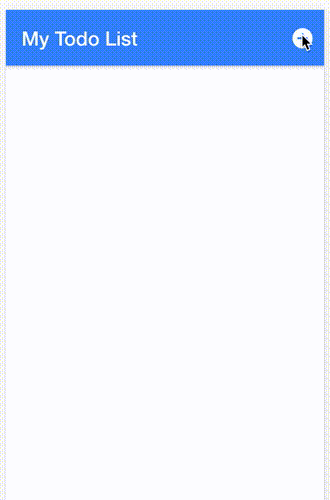

Now that we are able to add locations, lets replace our hardcoded todos in a smiliar manner.

Update **todolist-page.ts** to reflect the following:

```js
import { Component } from '@angular/core';
import { NavController, NavParams, AlertController } from 'ionic-angular';

@Component({
  selector: 'todolist-page',
  templateUrl: 'todolist-page.html'
})

export class TodolistPage {

  checklist: any; 

  constructor(public navCtrl: NavController, public navParams: NavParams, public alertCtrl: AlertController) {
    this.checklist = this.navParams.get('todolist');
  }

}
```

We import [NavParams](http://ionicframework.com/docs/v2/api/navigation/NavParams/) so we can access our Todolist data from it (need to expand). We then set checklist as a class variable and then access our `todolist` from navParams and save it as `checklist`. Now we can start adding our todos similiar to how we added our location. 

We first need to update our model by adding a function that allows us to add todos to a location. Add `addItem(item)` to **todolist-model.ts:**

```js
export class TodolistModel {
    
    constructor(public location: string, public todos: any[]) {
       
    }

    addTodo(title): void {
        this.todos.push ({
            title: title,
            checked: false 
        });
    }

}
```

As you can see our `addTodo` function takes in a title from the user and pushes this to the `todos` array. Now lets use this function to add todos to our location in a simliar way we did for locations:

Add `addTodo()` to **todolist-page.ts**:

```js
addTodo(): void {

    let prompt = this.alertCtrl.create({
      title: 'Add Todo',
      message: 'Enter your todo for this location below:',
      inputs: [
        {
          name: 'name'
        }
      ],
      buttons: [
        {
          text: 'Cancel'
        },
        {
          text: 'Save',
          handler: data => {
            this.todolist.addItem(data.name);
          }
        }
      ]
    });

    prompt.present(); 
  }
```

Now lets pull our user’s input and update our front-end in **todolist-page.html:**

```js
<ion-header>

  <ion-navbar color="primary">

    <ion-title>
      {{ todolist.title }}
    </ion-title>

    <ion-buttons end>

      <button ion-button icon-only>
        <ion-icon name="refresh-circle"></ion-icon>
      </button>

      <button ion-button icon-only (click)="addItem()">
        <ion-icon name="add-circle"></ion-icon>
      </button>

    </ion-buttons>
  </ion-navbar>
  
</ion-header>

<ion-content>

  <ion-list no-lines>

    <ion-item-sliding *ngFor="let todo of todolist.todos">

      <ion-item>
        <ion-label>{{ todo.title }}</ion-label>
        <ion-checkbox> </ion-checkbox>
      </ion-item>

      <ion-item-options>

        <button ion-button icon-left color="light">
          <ion-icon name="clipboard"></ion-icon>
          Edit
        </button>

        <button ion-button icon-left color="danger">
          <ion-icon name="trash"></ion-icon>
          Delete
        </button>

      </ion-item-options>
      
    </ion-item-sliding>

  </ion-list>

</ion-content>
```

Simliar to **home.ts**, we added `{{ todolist.title }}` and iterated over our todos array using `*ngFor=“let todo of todolist.todos”`​. You should now be able to create a location, add todos, and see them populate. Also you’ll see that our count of todos is functional.




