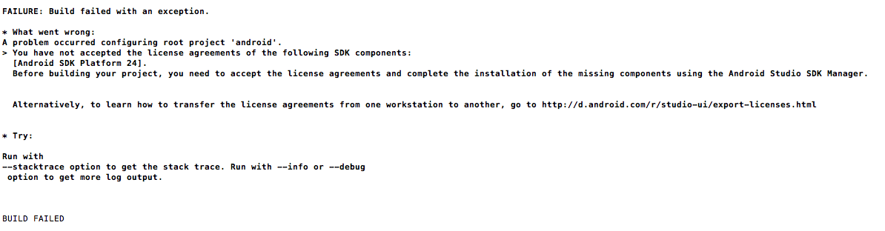
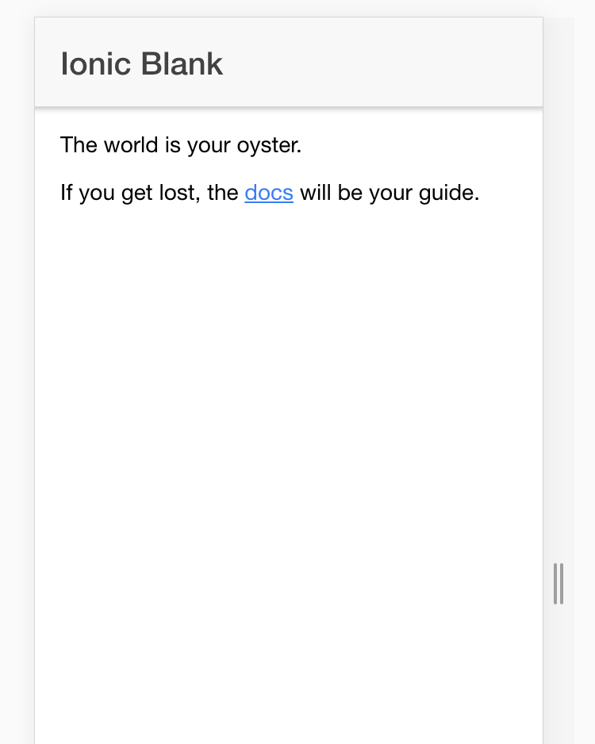

Why Ionic 
----------

Ionic is a framework that allows you to create [Progressive Web Apps](http://ionicframework.com/docs/v2/resources/progressive-web-apps/) using HTML, CSS, and JavaScript. A more detailed description is Ionic is a set of CSS classes and a library of JavaScript directives and modules built on top of Cordova with Angular. Cordova is an open source project that uses HTML, CSS, and JavaScript for mobile apps. Phonegap is similar to Cordova except that Phonegap is owned by Adobe. 

 It’s a great way to get into mobile development because it lowers the barriers of entry to mobile app development and because one code base is compatible with all mobile devices, as opposed to learning Objective-C for Android and Swift for Apple. 

Learning and using Ionic 2 is a great way to learn more about Angular 2, ES6 JavaScript, Typescript, API calls, and web development in general. If you’re looking for a programming job, this is a good way to shape up your skills and show off something to a potential employer. On top of all of this, it’s fun to use!

So lets get started by getting Ionic installed!

---

Installing and Generating your First Project
--------------------------------------------

1\. You’re going to need to install Node and NPM if you don’t have them already:

* *[Install NodeJS](https://nodejs.org/en/)
 Install `​npm`​ by running `​sudo install npm -g`​

2\. Then you’re going to need to install Xcode from Apple. [The Mac App](https://developer.apple.com/xcode/downloads/) store is the easiest approach.

3\. Check if you have Java installed by running `​java -version`​ If not, you’ll need to [download and install it](http://www.oracle.com/technetwork/java/javase/downloads/jdk8-downloads-2133151.html).

4\. Download Android Studio and run their installer. 

5\. Now we need to set our PATH variables. `​`​To find your `​JAVA_HOME`​ path, run the following command:

`​    find / -name java`

```

```

​You’ll see a lot of output, but you should find the most direct/shortest route such as something like `​/usr/share/java`​. Then run `​open -e .bash_profile`​ and add the following: 

`# Add the Android SDK to the PATH variableexport PATH=${PATH}:~/Library/Android/sdk/tools:~/Library/Android/sdk/platform-tools`

`# Create a JAVA_HOME variable, determined dynamically `

`export `JAVA\_HOME=$(/usr/share/java)`​`​

`# Add that to the global PATH variable`

`export PATH=${JAVA_HOME}/bin:$PATH`

6\. Finally we can now install Ionic (and Cordova) !

npm install -g ionic cordova

7\. By default Ionic ships with an IOS platform. To add the Android platform simply run the following command:

​ionic platform add android

If you run into a license accepting issue, run the following command: 



*License agreement issue*

`​`android update sdk --no-ui --filterbuild-tools-24.0.2,android-24,extra-android-m2repository

8\. And now you can finally generate an Ionic app by simply running:

`​ionic start myAwesomeApp blank —v2`

9\. Now `​cd`​ into your app and run `​ionic serve`​ to view your app in the browser:

`​  cd myAwesomeApp`

`  ionic serve`

And you should see the following:



A neat feature of ionic serve is that your changes will be reflected in the browser without refreshing the page. You can kill the local server by pressing `​Ctrl + C`

The command we used generated a new app that uses a blank template. Ionic provides other built in templates that can be viewed by running `​ionic start —-list `


If you’re curious about other available platforms, run this command:

`  ionic platform`

Get Your App Ready to Go
------------------------

We will need to a ‘whitelist’ policy for our app that defines what is allowed to be loaded in our app by running the following command:

`​ionic plugin add cordova-plugin-whitelist`

```

```

We’ll also need to add a [Content Security Policy](https://cordova.apache.org/docs/en/latest/reference/cordova-plugin-whitelist/) that controls which network requests are allowed to be made. Add the following to **src/index.html:**

```html
<meta http-equiv="Content-Security-Policy" content="font-src 'self' data:; img-src * data:; default-src * 'unsafe-eval' 'unsafe-inline'"> 
```

It’s also a good idea to always add the [Crosswalk](https://crosswalk-project.org/) plugin to ensure that your app works well on older devices by running the following command:

`​ionic plugin add cordova-plugin-crosswalk-webview`


