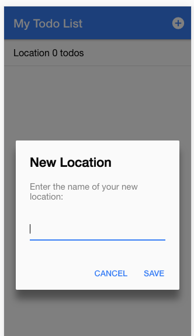
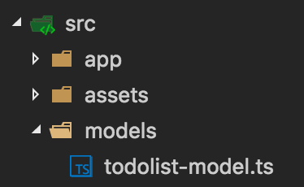
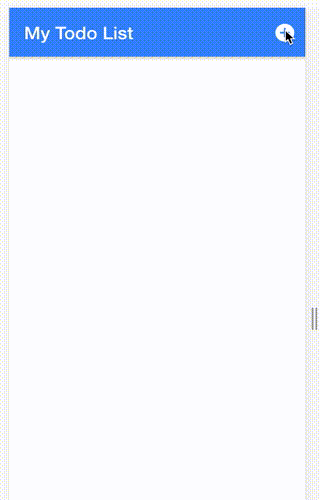

Adding a New Location Form
--------------------------

**In home.html l**ets start by building out our `add-circle` button at the upper right-hand corner on our Location list page. We’ll be taking advantage of Ionic’s [AlertController](http://ionicframework.com/docs/v2/api/components/alert/AlertController/) to take in the location name of our todo list. To do this we’ll first have to import it in **home.ts** by adding **AlertController** to the import line of ‘ionic-angular' :

```js
import { NavController, AlertController } from 'ionic-angular';
```

Then we need to add it to our constructor:

```js
constructor(public navCtrl: NavController, public alertCtrl: AlertController) {
    
  }
```

And now we can use it in our class as so:

```js
addLocationlist(): void {

    let prompt = this.alertCtrl.create({
      
      title: 'New Location',
      message: 'Enter the name of your new location:',
      inputs: [
        {
          name: 'location'
        }
      ],
      buttons: [
        {
          text: 'Cancel'
        },
        {
          text: 'Save',
          handler: data => {
            console.log('Data saved!');
          }
        }
      ]
    });
    
    prompt.present(); 
    
  }
```

Lets now update **home.html** to invoke our function:

```js
<ion-buttons end>
    <button ion-button icon-only (click)="addLocationlist()" >
      <ion-icon name="add-circle"></ion-icon>
    </button>
</ion-buttons>
```

Now when you click our `add-circle` button you should see



If you hit save you’ll see our “Data saved!” in the console.

---

Capturing and Displaying Location Data
--------------------------------------

Currently our app shows a location and a todo that is hard coded. Before we get into how to make this dynamic we should think about how we want our todo list data modeled. Since Ionic does not have a model generator we’ll have to create it ourselves. 

Lets get started by creating a new directory inside **src** called **models. **

**
**

Then create a file called **todolist-model.ts** in this directory like so:



Update **todolist-model.ts** to the following:

```js
export class TodolistModel {
    
    constructor(public location: string, public items: any[]) {
       
    }

}
```

Our todolist model is sparse for the moment but we’ll build it out soon. 

Now we need to capture the location that the user enters in our form and display it on our homepage. To capture the user input, update the handler in `addLocationlist()` in **home.ts **to the following:

```js
export class HomePage {

  todolists: TodolistModel[] = [];

  constructor(public navCtrl: NavController, public alertCtrl: AlertController) {
    
  }

  viewTodolist(todolist): void {
    this.navCtrl.push(TodolistPage, {
      todolist: todolist
    });
  }

  addLocationlist(): void {

    let prompt = this.alertCtrl.create({
      title: 'New Location',
      message: 'Enter the name of your new location:',
      inputs: [
        {
          name: 'location'
        }
      ],
      buttons: [
        {
          text: 'Cancel'
        },
        {
          text: 'Save',
          handler: data => {
            
            let newTodolist = new TodolistModel(data.location, []);
            this.todolists.push(newTodolist);

            console.log('Data saved!');
          }
        }
      ]
    });
    prompt.present(); 
  }

}
```

Here we instantiate a new `TodolistModel` with `data.location` as it’s location and an empty array and save it as `newTodolist`. We then push this to `todolists`​, which is now declared at the top of our class (on line 3) which makes it accessible throughout by using `this`​. Now that this is setup we need to display it on our front-end in **home.html. **

Update `ion-item-sliding` in **home.html** to the following:

```js
<ion-item-sliding *ngFor="let todolist of todolists">

      <button ion-item (click)="viewTodolist(todolist)">
        {{todolist.location }}
        <span>{{todolist.items.length}} todos</span>
      </button>
      
........
```

We added [\*ngFor](https://angular.io/docs/ts/latest/api/common/index/NgFor-directive.html) to iterate over our todolists as a todolist (help?). Then we replace our text with `{{ todolist.location }}` to display the location from the user and `{{ todolist.items.length }}`​ to display the count of any todos for our list. You should now be able to enter a new location, hit Save, and it will appear on **home.html**

**
**




---


Capturing User Input
--------------------

You’re probably noticing that a good work flow is to build out the front end, then make it functional, and then connect the wires. Now we’re going to work on capturing the location name using a model and saving it in a database. 

### Local Storage

Ionic has the ability to utilize many storage options. [Local Storage](http://www.w3schools.com/html/html5_webstorage.asp) is the most basic way to store data locally in the browser, since your app is a hybrid app, you can take advatage of this HTML5 feature. [Local Storage](http://www.w3schools.com/html/html5_webstorage.asp) is best for temporary data such as session tokens.

### SQLite

Mobile devices have an embedded SQL database.

### Storage

Ionic has a great [storage service](https://ionicframework.com/docs/v2/storage/) that will automagically use the best availabe storage method. We’ll take advantage of this with SQLite. Install SQLite by running the following command:

`cordova plugin add cordova-sqlite-storage —save`

```

```

`​`​And lets tell Ionic that we’ll be using Storage by importing it to **src/app/app.module.ts and adding it to our `Providers` array: **

```js
import { NgModule } from '@angular/core';
import { IonicApp, IonicModule } from 'ionic-angular';
import { MyApp } from './app.component';

import { Storage } from '@ionic/storage';  // <== add this

import { HomePage } from '../pages/home/home';
import { TodolistPage } from '../pages/todolist-page/todolist-page';

@NgModule({
  declarations: [
    MyApp,
    HomePage,
    TodolistPage
  ],
  imports: [
    IonicModule.forRoot(MyApp)
  ],
  bootstrap: [IonicApp],
  entryComponents: [
    MyApp,
    HomePage,
    TodolistPage
  ],
  providers: [Storage] // <== add this too
})
export class AppModule {}

```


