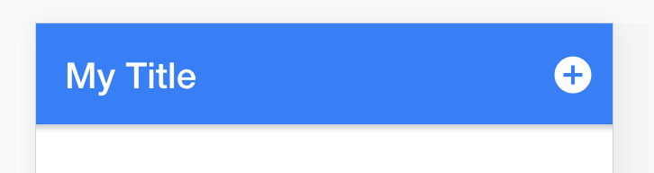
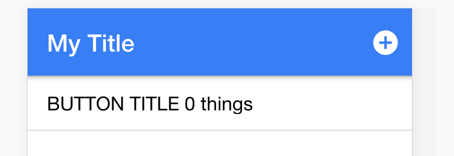
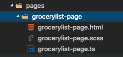

The best way to learn how to start building with Ionic is to actually build something. Here we’re going to build a traditional todo list. Sounds boring, but it teaches basic CRUD functionality and we’ll add a few perks in the process to spice things up. 

Be sure to have your app running in the browser with `​ionic serve`​ !

Our Homepage will list stores in which we need to buy things from, and when we select the store it’ll display a list of items that can be checked off.

Building out our Home Page
--------------------------

---

Lets start by building out our homepage. To begin lets start with the header:

Update** src/pages/home/home.html** to the following:

```html
<ion-header>
  
  <ion-navbar color="primary">

    <ion-title>
      My Title
    </ion-title>
    
    <ion-buttons end> 
      <button ion-button icon-only>
        <ion-icon name="add-circle"></ion-icon>
      </button>
    </ion-buttons>

  </ion-navbar>
  
</ion-header>   
```

What the header should look like: 



Lets walk though this line by line. The `​<ion-header>`​ defines the header and we create an [ion-navbar](http://ionicframework.com/docs/v2/api/components/navbar/Navbar/) and set it’s color to “primary" it on line 3\. Color variables such as this are defined at **theme/variable.scss**. The `​[ion-title](http://ionicframework.com/docs/v2/api/components/toolbar/Title/)`​ displays a text title and can display header images as well. 

We also use [ion-buttons](http://ionicframework.com/docs/v2/api/components/button/Button/) to create a button in the navbar. The ‘end’ attribute specifies that the button will be places on the right side on iOS and the ’start’ attribute would place it on the left. By using `​ion-button`​ and `​icon-only`​ attributes tells ionic to use ionic’s styling and to style the button with only an [ion-icon](http://ionicframework.com/docs/v2/api/components/icon/Icon/). 

The docs do a great job at explaining what `​<ion-navbar>`​ does:

*Navbar acts as the navigational toolbar, which also comes with a back button. A navbar can contain a `ion-title`, any number of buttons, a segment, or a searchbar. Navbars must be placed within an `<ion-header>`**in order for them to be placed above the content. It's important to note that navbar's are part of the dynamic navigation stack. If you need a static toolbar, use ion-toolbar*.

Lets build out the rest of our checklist. Add the following code below `​</ion-header>`​:

```html
<ion-content>

  <ion-list no-lines>

    <ion-item-sliding>

      <button ion-item>
        BUTTON TITLE 
        <span>0 things</span>
      </button>

      <ion-item-options>

        <button ion-button icon-only color="light">
          <ion-icon name="clipboard"></ion-icon>
          Edit
        </button>

        <button ion-button icon-only color="danger">
          <ion-icon name="trash"></ion-icon>
          Delete
        </button>

      </ion-item-options>

    </ion-item-sliding>

  </ion-list>

</ion-content>      
```

You should see this: 



Slide the bar to the left to see the Edit and Delete buttons we created in [​ion-item-sliding](http://ionicframework.com/docs/v2/components/#sliding-list).

That’s it for now for the Homepage. Lets get our ListPage built out.

Building out our GrocerylistPage
--------------------------------

Create our GrocerylistPage by running the following Ionic CLI command:

`​ionic g page GrocerylistPage`

And you’ll see the following generated in your file directory:



We need to let Ionic know about this page by importing it in the entry point of our app **src/app/app.module.ts **by updating it to look like this:

```js
import { NgModule } from '@angular/core';
import { IonicApp, IonicModule } from 'ionic-angular';
import { MyApp } from './app.component';

import { HomePage } from '../pages/home/home';
import { GrocerylistPage } from '../pages/grocerylist-page/grocerylist-page';

@NgModule({
  declarations: [
    MyApp,
    HomePage,
    GrocerylistPage
  ],
  imports: [
    IonicModule.forRoot(MyApp)
  ],
  bootstrap: [IonicApp],
  entryComponents: [
    MyApp,
    HomePage,
    GrocerylistPage
  ],
  providers: []
})

export class AppModule {}

```

In the above image we imported our GrocerylistPage on line 6 and then declared it on line 12 and line 21\. Any pages we create need to be added to both the `declarations` and `entryComponents` array. Any providers we create will be added to the providers array, and any components or pipes we create will only need to be added to the `declarations` array.

Lets now get to work building out **src/pages/grocerylist-page/grocerylist-page.html**. Update your file to the following:

```js
<ion-header>

  <ion-navbar color="primary">

    <ion-title>
      Grocerylist Title
    </ion-title>

    <ion-buttons end>

      <button ion-button icon-only>
        <ion-icon name="refresh-circle"></ion-icon>
      </button>

      <button ion-button icon-only>
        <ion-icon name="add-circle"></ion-icon>
      </button>

    </ion-buttons>
  </ion-navbar>
  
</ion-header>

<ion-content>

  <ion-list no-lines>

    <ion-item-sliding>

      <ion-item>
        <ion-label>Item Title</ion-label>
        <ion-checkbox></ion-checkbox>
      </ion-item>

      <ion-item-options>

        <button ion-button icon-only color="light">
          <ion-icon name="clipboard"></ion-icon>
          Edit
        </button>

        <button ion-button icon-only color="danger">
          <ion-icon name="trash"></ion-icon>
          Delete
        </button>

      </ion-item-options>
      
    </ion-item-sliding>
    
  </ion-list>

</ion-content>
```

This setup is just like what we did **home.ts**. We’re now going to start writing some functions so we can see this page.

Update **src/home/home.ts** to the following:

```js
import { Component } from '@angular/core';
import { NavController } from 'ionic-angular';

@Component({
  selector: 'page-home',
  templateUrl: 'home.html'
})

export class HomePage {

  constructor(public navCtrl: NavController) {
    
  }

  viewChecklist(checklist): void {

  }

}
```

We’re importing `Component` from Angular that allows us to use the [@Component](http://learnangular2.com/components/) decorator and importing `NavController` from Ionic that allows us to [control navigation](http://ionicframework.com/docs/v2/api/navigation/NavController/). 

Update `​viewChecklist`​ to the following so we can navigate to a specific location’s checklist:

```js
viewChecklist(checklist): void {
    this.navCtrl.push(GrocerylistPage, {
      checklist: checklist
    });
  }
```

Since we need `​GrocerylistPage`​, we’ll need to import it by adding the following line of code at the top of our page:

```js
import { GrocerylistPage } from '../grocerylist-page/grocerylist-page';
```

Now we need to call `viewChecklist` from our `button` on `home.html` by adding :

```js
     <button ion-item (click)="viewChecklist(checklist)">
        BUTTON TITLE 
        <span>0 things</span>
      </button>
```

Now you should be able to click on a location item and view it’s checklist.

Ionic2 navigation is like an array in which you `push` and `pop` off pages. You can think of our homepage as this:

```js
let navCtrl = ['homePage'];
```

If we want to go to a second page, we would `push` it to our `navigationStack` with `​this.navCtrl.push(‘secondPage’);`

```js
this.navCtrl.push('secondPage');

// would result in 

navCtrl = ['homePage', 'secondPage'];
```

A cool feature with Ionic is that it will automatically add a back button, thus popping off a page in the navCtrl array:

```js
this.navCtrl.pop();

// would result in

navCtrl = ['homePage']; 
```


